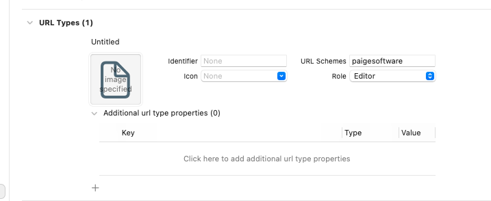

# Add URLScheme



# Core

- App

```swift
@main
struct SwiftUIDeepLinkApp: App {

    @StateObject var appData: AppDataModel = AppDataModel()

    var body: some Scene {
        WindowGroup {
            ContentView()
                .environmentObject(appData)
                .onOpenURL { url in
                    // used to fetch the deep link url...
                    print("incoming url: \(url)")
                    if appData.checkDeepLink(url: url) {
                        print("FROM DEEP LINK")
                    } else {
                        print("FALL BACK DEEP LINK")
                    }
                }
        }
    }
}
```

- ViewModel

```swift
//
//  AppDataModel.swift
//  SwiftUIDeepLink
//
//  Created by paige on 2022/01/14.
//

import Combine
import Foundation

class AppDataModel: ObservableObject {

    @Published var currentTab: Tab = .home
    @Published var currentDetailPage: String?

    func checkDeepLink(url: URL) -> Bool {

        guard let host = URLComponents(url: url, resolvingAgainstBaseURL: true)?.host else {
            return false
        }

        // Updating Tabs...
        if host == Tab.home.rawValue {
            // paigesoftware://home
            currentTab = .home
        } else if host == Tab.search.rawValue {
            // paigesoftware://search
            currentTab = .search
        } else if host == Tab.settings.rawValue {
            // paigesoftware://settings
            currentTab = .settings
        } else {
            return checkInternalLinks(host: host)
        }

        return true
    }

    func checkInternalLinks(host: String) -> Bool {
        // paigesoftware://CCFFB11

        // checking if host contains any navigation link ids...
        if let index = coffees.firstIndex(where: { coffee in
            return coffee.id == host
        }) {

            // Chaning to search tab...
            // since navigation links are in search tab
            currentTab = .search
            // setting nav link selection...
            self.currentDetailPage = coffees[index].id


            return true
        }

        return false
    }

}

// Tab enum...
enum Tab: String {
    case home = "home"
    case search = "search"
    case settings = "settings"
}
```

- WHERE IT RECEIVES #1

```swift
struct Home: View {

    @EnvironmentObject var appData: AppDataModel

    var body: some View {
        TabView(selection: $appData.currentTab) {

            Text("Home")
                .tag(Tab.home)
                .tabItem {
                    Image(systemName: "house.fill")
                }

            SearchView()
                .environmentObject(appData)
                .tag(Tab.search)
                .tabItem {
                    Image(systemName: "magnifyingglass")
                }

            Text("Settings")
                .tag(Tab.settings)
                .tabItem {
                    Image(systemName: "gear")
                }

        }
    }
}
```

- WHERE IT RECEIVES #2

```swift
 NavigationLink(tag: coffee.id, selection: $appData.currentDetailPage) {
                  detailView(coffee: coffee)
              } label: {
}
```

```swift
NavigationView {

            List {

                // List of availble coffees.
                ForEach(coffees) { coffee in

                    // Setting tag and selection so that whenever we update selection
                    // that navigation link will be called...
                    NavigationLink(tag: coffee.id, selection: $appData.currentDetailPage) {
                        detailView(coffee: coffee)
                    } label: {
                        HStack(spacing: 15) {

                            Image(coffee.productImage)
                                .resizable()
                                .aspectRatio(contentMode: .fill)
                                .frame(width: 80, height: 80)
                                .cornerRadius(15)

                            VStack(alignment: .leading, spacing: 10) {
                                Text(coffee.title)
                                    .font(.title2.bold())
                                    .foregroundColor(.primary)
                                Text(coffee.productPrice)
                                    .font(.callout)
                                    .fontWeight(.semibold)
                                    .foregroundColor(.gray)
                            }

                        }
                    }
                }

            }
            .navigationTitle("Search")
            // to show demo how it works...
//            .toolbar {
//                Button("GOTO NAV LINK 3") {
//                    appData.currentDetailPage = coffees[2].id
//                }
//            }

        }
```

# Model

```swift
struct Coffee: Identifiable {
    var id: String
    var title: String
    var description: String
    var productImage: String
    var productPrice: String
}

var coffees: [Coffee] = [
    Coffee(id: "CCFFB11", title: "1", description: "", productImage: "1", productPrice: "$17"),
    Coffee(id: "CCFFB12", title: "2", description: "", productImage: "2", productPrice: "$17"),
    Coffee(id: "CCFFB13", title: "3", description: "", productImage: "3", productPrice: "$17"),
    Coffee(id: "CCFFB14", title: "4", description: "", productImage: "4", productPrice: "$17"),
    Coffee(id: "CCFFB15", title: "5", description: "", productImage: "5", productPrice: "$17"),
    Coffee(id: "CCFFB16", title: "6", description: "", productImage: "6", productPrice: "$17"),
]
```

# App Data Model

```swift
//
//  AppDataModel.swift
//  SwiftUIDeepLink
//
//  Created by paige on 2022/01/14.
//

import Combine
import Foundation

class AppDataModel: ObservableObject {

    @Published var currentTab: Tab = .home
    @Published var currentDetailPage: String?

    func checkDeepLink(url: URL) -> Bool {

        guard let host = URLComponents(url: url, resolvingAgainstBaseURL: true)?.host else {
            return false
        }

        // Updating Tabs...
        if host == Tab.home.rawValue {
            // paigesoftware://home
            currentTab = .home
        } else if host == Tab.search.rawValue {
            // paigesoftware://search
            currentTab = .search
        } else if host == Tab.settings.rawValue {
            // paigesoftware://settings
            currentTab = .settings
        } else {
            return checkInternalLinks(host: host)
        }

        return true
    }

    func checkInternalLinks(host: String) -> Bool {
        // paigesoftware://CCFFB11

        // checking if host contains any navigation link ids...
        if let index = coffees.firstIndex(where: { coffee in
            return coffee.id == host
        }) {

            // Chaning to search tab...
            // since navigation links are in search tab
            currentTab = .search
            // setting nav link selection...
            self.currentDetailPage = coffees[index].id


            return true
        }

        return false
    }

}

// Tab enum...
enum Tab: String {
    case home = "home"
    case search = "search"
    case settings = "settings"
}
```

# App

```swift
//
//  SwiftUIDeepLinkApp.swift
//  SwiftUIDeepLink
//
//  Created by paige on 2022/01/14.
//

import SwiftUI

@main
struct SwiftUIDeepLinkApp: App {

    @StateObject var appData: AppDataModel = AppDataModel()

    var body: some Scene {
        WindowGroup {
            ContentView()
                .environmentObject(appData)
                .onOpenURL { url in
                    // used to fetch the deep link url...
                    print("incoming url: \(url)")
                    if appData.checkDeepLink(url: url) {
                        print("FROM DEEP LINK")
                    } else {
                        print("FALL BACK DEEP LINK")
                    }
                }
        }
    }
}

// Integrating Deep Link...
// First create a url scheme for how to call your url...
// EG: paigesoftware
// calling will be done like `paigesoftware://`
```

# ContentView

```swift
//
//  ContentView.swift
//  SwiftUIDeepLink
//
//  Created by paige on 2022/01/14.
//

import SwiftUI

struct ContentView: View {

    @EnvironmentObject var appData: AppDataModel

    var body: some View {
        Home()
            .environmentObject(appData)
    }

}

struct ContentView_Previews: PreviewProvider {
    static var previews: some View {
        ContentView()
    }
}
```

# Home

```swift
//
//  Home.swift
//  SwiftUIDeepLink
//
//  Created by paige on 2022/01/14.
//

import SwiftUI

struct Home: View {

    @EnvironmentObject var appData: AppDataModel

    var body: some View {
        TabView(selection: $appData.currentTab) {

            Text("Home")
                .tag(Tab.home)
                .tabItem {
                    Image(systemName: "house.fill")
                }

            SearchView()
                .environmentObject(appData)
                .tag(Tab.search)
                .tabItem {
                    Image(systemName: "magnifyingglass")
                }

            Text("Settings")
                .tag(Tab.settings)
                .tabItem {
                    Image(systemName: "gear")
                }

        }
    }
}

struct Home_Previews: PreviewProvider {
    static var previews: some View {
        Home()
    }
}

// Search View...
struct SearchView: View {

    @EnvironmentObject var appData: AppDataModel

    var body: some View {

        NavigationView {

            List {

                // List of availble coffees.
                ForEach(coffees) { coffee in

                    // Setting tag and selection so that whenever we update selection
                    // that navigation link will be called...
                    NavigationLink(tag: coffee.id, selection: $appData.currentDetailPage) {
                        detailView(coffee: coffee)
                    } label: {
                        HStack(spacing: 15) {

                            Image(coffee.productImage)
                                .resizable()
                                .aspectRatio(contentMode: .fill)
                                .frame(width: 80, height: 80)
                                .cornerRadius(15)

                            VStack(alignment: .leading, spacing: 10) {
                                Text(coffee.title)
                                    .font(.title2.bold())
                                    .foregroundColor(.primary)
                                Text(coffee.productPrice)
                                    .font(.callout)
                                    .fontWeight(.semibold)
                                    .foregroundColor(.gray)
                            }

                        }
                    }
                }

            }
            .navigationTitle("Search")
            // to show demo how it works...
//            .toolbar {
//                Button("GOTO NAV LINK 3") {
//                    appData.currentDetailPage = coffees[2].id
//                }
//            }

        }

    }

    // Detail View...
    @ViewBuilder
    func detailView(coffee: Coffee) -> some View {

        ScrollView(.vertical, showsIndicators: false) {
            VStack {
                Image(coffee.productImage)
                    .resizable()
                    .aspectRatio(contentMode: .fill)
                    .frame(width: UIScreen.main.bounds.width, height: 200)
                    .cornerRadius(0)

                VStack(alignment: .leading, spacing: 12) {

                    Text(coffee.title)
                        .font(.title.bold())
                        .foregroundColor(.primary)

                    Text(coffee.productPrice)
                        .fontWeight(.semibold)
                        .foregroundColor(.gray)

                    Text(coffee.description)
                        .multilineTextAlignment(.leading)

                }
                .padding()
            }
        }
        .navigationTitle(coffee.title)
        .navigationBarTitleDisplayMode(.inline)

    }

}
```
